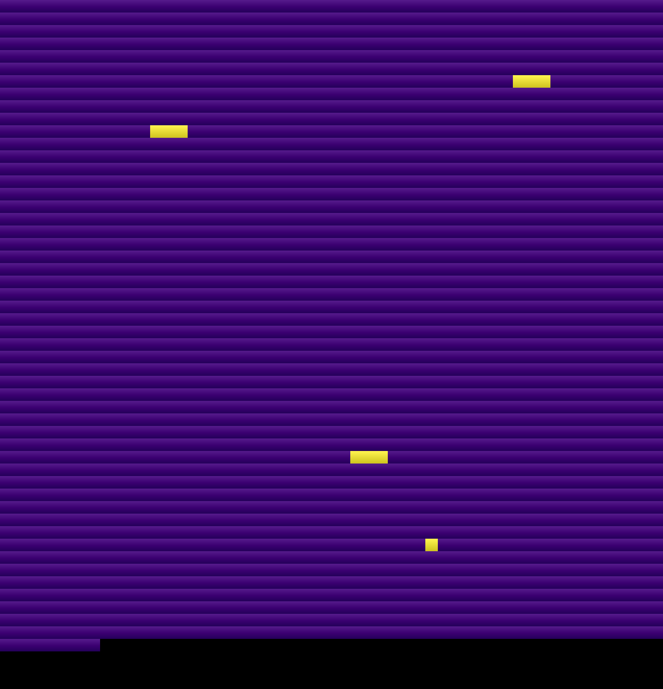
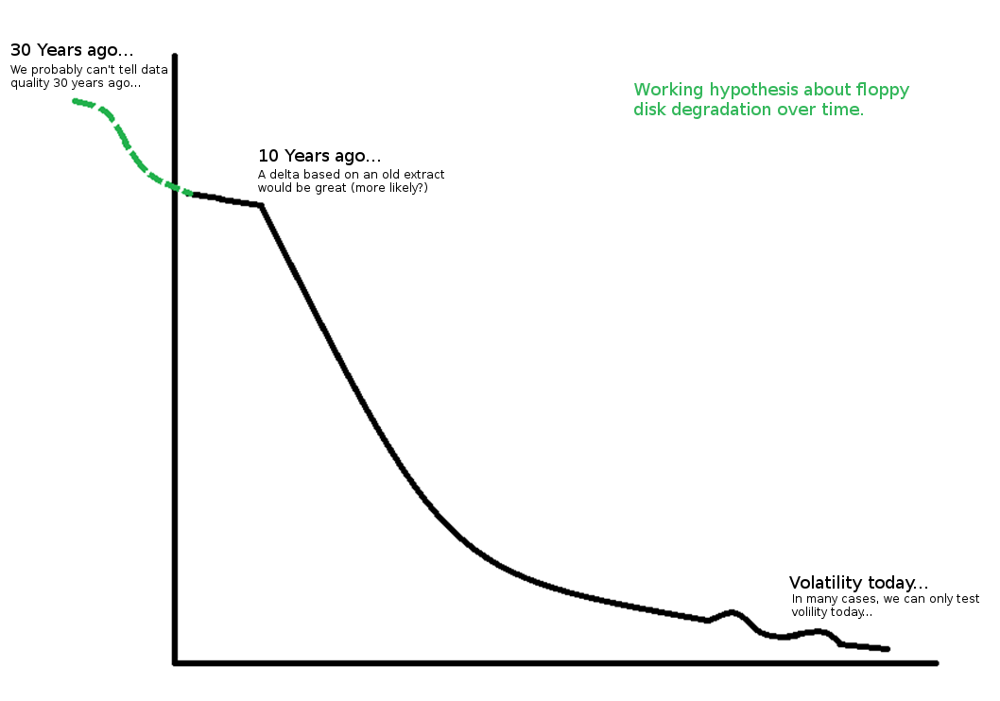

# vizdiff (Visual Binary Diff)

Compare two identically sized files for byte by byte differences, e.g. floppy disk extracts

## Intro

Output a PNG visualization of two byte-streams. 

A rudimentary tool to begin with to compare two identically sized streams. Lots
of scope for improvement if it proves to be useful. 

## Examples

### Example of a diff between two 5.25" disks, ~10 years apart

### Hypothesis based on early testing

## Testing volility today?

1. We will first notice a checksum difference,
2. But how different are they?

If there are no legacy disk images/checksums to compare against, then we can still understand
the volility of the disk today. Take two extracts, with a small amount of time between doing so
and then compare them. 

I believe this is the equivalent to be hard of seeing/hearing.

The reader will do its best to understand, but the signal is analogue so its understanding is
on a spectrum. We're not expecting binary results from a volatile analog medium.

## What an archive may need

Is an ability to make a statement about the health of the disk. To make a disclaimer about data
and record integrity. The user of the archive has to be able to fill in the gaps without more
questions being raised - provenance. 

### License

GPL Version 3: https://github.com/exponential-decay/visual-binary-diff/blob/master/LICENSE
